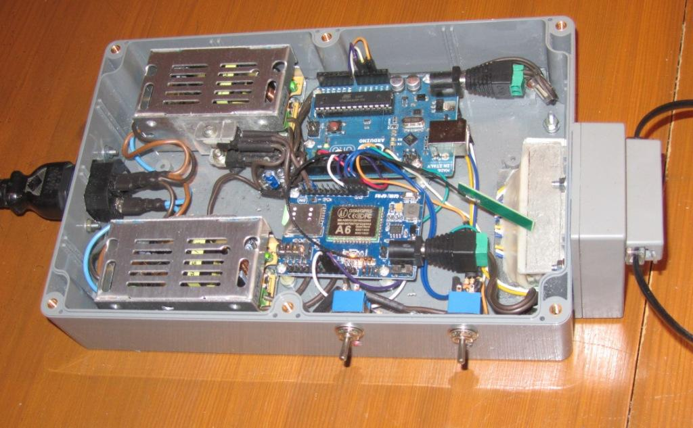

# SMS-термометр Журавли GRUS

Задача: получать показания термометра дистанционно, посредством SMS-сообщений.

Берём на вооружение плату контроллера Arduino Uno https://store.arduino.cc/arduino-uno-rev3, модем AI-Thinker A6 GSM module на плате https://ru.aliexpress.com/i/32801821645.html и цифровые датчики температуры DS18B20  https://datasheets.maximintegrated.com/en/ds/DS18B20.pdf .

При написания кода для Arduino воспользуемся библиотеками OneWire 
https://www.pjrc.com/teensy/td_libs_OneWire.html и LCDi2cW https://github.com/javastraat/arduino/tree/master/libraries/LCDi2cW 

Программа grus.ino использует 10 килобайт Flash Memory и 1 килобайт SRAM.

## Схема электрическая принципиальная


## Корпус
Всю электронную начинку поместили в корпус G353 производства Gainta Industries Ltd. http://www.gainta.com.tw/ 


## Внешний вид SMS-термометра


На верхней крышке размещён дисплей LCD, на котором отображается информация о качестве GSM-сигнала и данные от датчиков темепратуры.


На передней панеле имеются два тумблера. Левый тумблер подаёт питание 6 вольт на плату A6 GSM/GPRS, правый тубмлер замыкает контакт VBAT платы A6 GSM/GPRS на контакт POWER_KEY (по функции это своего рода "стартёр"). Тумблеры всегда должны быть установленны в верхнем положении, то есть быть во включеном состоянии. Индикатор под левым тумблером светится постоянно, индикатор под правым тумблером изредка мигает.

Отсутствие свечения индикаторов под тублерами означает: под левым - на модеме A6 GSM/GPRS нет питания 6 вольт, под правым - модем не стартовал.

Непрерывное свечение индикатора под левым тумблером сигнализирует о наличии питания 6 вольт на плате модема A6 GSM/GPRS. 

Непрерывное свечение индикатора под правым тумблером сигнализирует о том что SMS-термометр стартует: контакт VBAT платы A6 GSM/GPRS замкнут на контакт POWER_KEY и контроллер Arduino пытается установить связь с модемом A6 GSM/GPRS.

С выходом на штатный рабочий режим индикатор по правым тумблером, мигая раз в 10 секунд, сигнализирует о том что, во первых, контакт VBAT платы A6 GSM/GPRS соединён с контактом POWER_KEY, и, во вторых, SMS-термометр работает нормально, штатно. Собственно, замыкать контакты POWER_KEY и VBAT необходимо только при старте, это стартёр, но если мы хотим чтобы SMS-термометр мог стартовать после временного пропадания электроэнергии без нашего участия, надо оставить в замкнутом положении контакты POWER_KEY и VBAT, то есть оставить правый тумблер во включённом состоянии, в верхнем положении.

Единственно, если SMS-термометр не выходит самостоятельно на рабочий режим (плата Arduino не может настроить связь с модемом A6 GSM/GPRS), тогда могут понадобиться манипуляции с тумблерами. В этом случае неоходимо выполнить следующие действия, строго в указанной последовательности:

1. Снять питание с SMS-термометра, тумблеры перевести в нижнее, выключенное, положение.

2. Подать питание на SMS-термометр; при этом запитается контроллер Arduino.

3. Включить, перевести в верхнее положение, левый тумблер; при этом запитается модем A6 GSM/GPRS.

4. Включить, перевести в верхнее положение, правый тумблер; при этом запускается  "стартёр" модема A6 GSM/GPRS.

## Вентиляция


Что касается теплового режима, то в отсутствии вентиляции корпуса стабилизаторы напряжения L7806CV и L7808CV нагреваются градусов на двадцать. Решено было  в верхней крышке проделать два вентиляционных отверстия диаметром 5 мм в предназначенные под крепёжные винты шахты. В нижней части корпуса в качестве вентиляционного отверстия служит технологический люк размером 13х14 мм, расположенный напротив USB Type-B разъёма платы Arduino для подсоединения оной по соответствующему кабелю к внешней ЭВМ.

## Внутренний монтаж


### Подключение дисплея к плате ардуино

* Вывод GND - провод зелёного цвета - подключается к GND на плате.
* Вывод SCL - провод жёлтого цвета - подключается к пину A5 платы.
* Вывод SDA - провод синего цвета - подключается к пину A4 платы.
* Вывод VCC – провод белого цвета - подключается к 5V платы



Питание каждой из плат, и Arduino и A6 GSM/GPRS, осуществляется от адаптера AC/DC ~220V/=12V 1А
https://ru.aliexpress.com/item/DC-12/32893669453.html с последующим понижением напряжения питания до 8 вольт для Arduino и до 6 вольт для A6 GSM/GPRS стабилизаторами напряжения L7808CV и L7806CV соответственно.

## Подсоединение датчиков

Датчики подсоединяем к SMS-термометру телефонным 4-х жильным кабелем. 


Для нас вариант ракладки кабеля не важен, но имейте в виду, дабы не смущаться, что в продаже можно встретить вариант кабеля и с прямой раскладкой, но чаще кросс-оверный вариант раскладки. 

Мы одну из вилок что на конце кабеля срезаем и на её место располагаем датчик DS18B20 по следующей раскладке:
```
Контакты    Контакты     Цвет 
RJ-14 6P4C  DS18B20      (прямой раскладки)  
--- 1 ---   не использ.  чёрный 
--- 2 ---   Data         красный 
--- 3 ---   GND          зелёный
--- 4 ---   +5V          жёлтый
```

 


